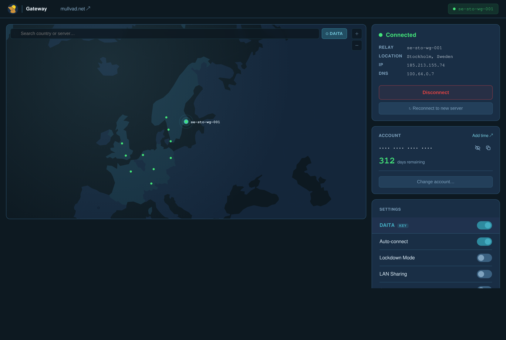

# Mullvad Gateway UI

A self-hosted web dashboard for managing a Mullvad VPN gateway from a browser. It drives the local
`mullvad` CLI behind an interactive orthographic globe: spin it, pick a city, connect. Built for a
gateway box (a Proxmox LXC, a VM, a spare Pi) where you want to see and change the tunnel without SSHing
in — but it runs on any Linux host with the Mullvad daemon installed.



The globe shows every relay city; the connected relay gets a ring. The right rail is connection status
(relay, location, exit IP, DNS) with connect/disconnect/reconnect, the account (days remaining), and the
settings that matter for a gateway: DAITA, auto-connect, lockdown mode, LAN sharing, quantum resistance,
and multihop. There's also a **reconnect webhook** so an ad-blocker or DNS filter can rotate the exit IP
on its own (see below).

## Quickstart

Needs Node.js 20+ and the [Mullvad daemon](https://mullvad.net/download) running.

```bash
npm install
npm run build
mullvad account login <your-16-digit-account-number>
node server.mjs                 # serves the dashboard + API on :80
# open http://<host-ip>/
```

`server.mjs` is a single Express process that serves the built `dist/` and shells out to `mullvad` for
every action. Configure it by editing the constants at the top — `PORT` (default `80`) and `LOG_FILE`
(default `/var/log/mullvad-blocked.log`).

## Run it as a service

```bash
cat > /etc/systemd/system/mullvad-ui.service << 'EOF'
[Unit]
Description=Mullvad Gateway UI
After=network.target mullvad-daemon.service
Wants=mullvad-daemon.service

[Service]
Type=simple
WorkingDirectory=/opt/mullvad-ui
ExecStart=/usr/bin/node /opt/mullvad-ui/server.mjs
Restart=always
RestartSec=5
Environment=NODE_ENV=production

[Install]
WantedBy=multi-user.target
EOF
systemctl daemon-reload && systemctl enable --now mullvad-ui
```

(There's an OpenRC equivalent — same idea, `node server.mjs` under a supervisor.) If you change anything
under `src/`, `npm run build && systemctl restart mullvad-ui`.

## Reconnect webhook

Any device on your network can trigger a relay rotation:

```
GET/POST http://<host-ip>/api/blocked?domain=example.com&reporter=<device-name>
```

The gateway picks a fresh relay (weighted by a running score that tracks per-relay blocks and failures,
with cooldowns and your region constraints), reconnects, logs the old→new relay and IP to `LOG_FILE`,
and returns them. The intent: when a DNS-based ad/tracker filter notices something getting through,
it can rotate the exit IP automatically instead of waiting for you.

## Development

```bash
npm run dev        # Vite dev server on :5173
node server.mjs    # run the backend separately on :80
```

Note the Vite dev server has no API proxy configured, so in dev the frontend's `/api/*` calls need
`server.mjs` reachable on the same origin (or a proxy in front). The built `dist/` served by
`server.mjs` has no such split.

## Stack

React 18 + React Router, a D3 `geoOrthographic` globe rendered to canvas (world topology from
`public/countries-110m.json`), built with Vite; an Express backend (`server.mjs`) that wraps the
`mullvad` CLI. Per-relay stats persist to `/var/lib/mullvad-ui/relay-stats.json`.
